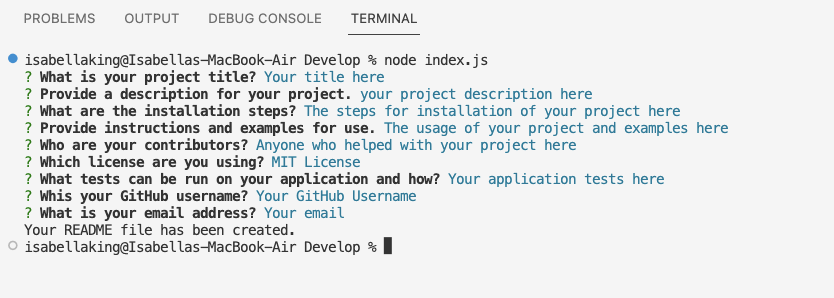
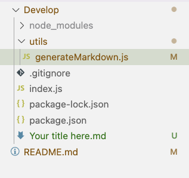
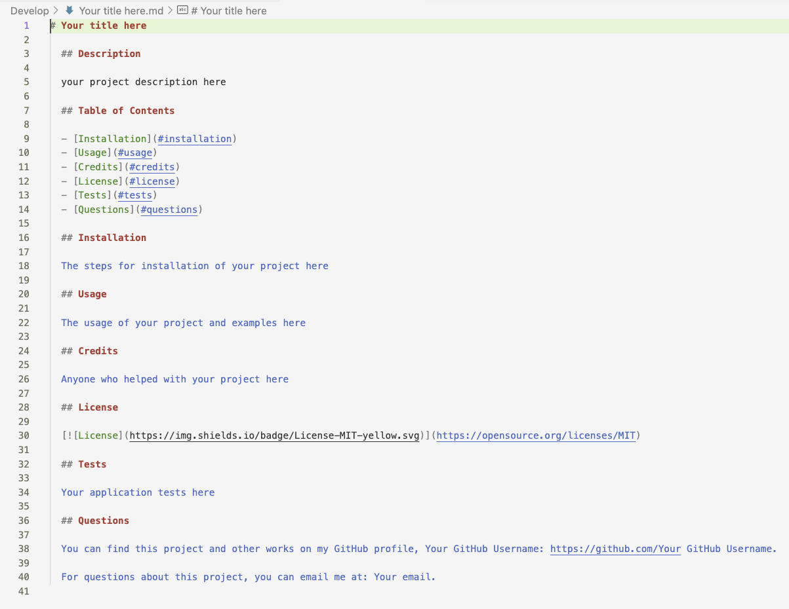

# Professional README Generator

## Description

As Developers, every project we create requires a professional README Page. Creating the mark down from scratch can be time-consuming, and this project aims to streamline this process. This project allows you to easily enter your project information, and generates the markdown for you. Throught this process I learned about operating within node.js and specifically about npm packages, and modularization.

## Table of Contents (Optional)

- [Installation](#installation)
- [Usage](#usage)
- [Credits](#credits)
- [License](#license)

## Installation

For this project, you will need Node.js and the node package, Inquirer version 8.2.4, installed in your environment.

To start, clone the repository:

```
git clone git@github.com:IsabellaKingson/README-generator.git README-generator
```

Then install inquirer:

```
cd README-generator
npm i inquirer@8.2.4
```

Then you are ready to run the program!

## Usage

Once you have everything installed, begin by running the following command:

```
node index.js
```

Then the inquirer will begin asking you questions about your project.


Once you have completed the questions, a file will be generated using markdown syntax with your project title and information.
    
    

## Credits

I completed this project on my own.

## License

[](https://opensource.org/licenses/MIT)
